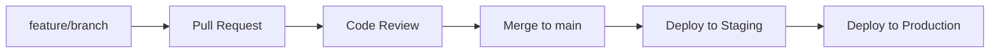

# 🗺️ Mapa Ambiental

[](https://nextjs.org/)
[](https://www.typescriptlang.org/)
[](https://tailwindcss.com/)
[](https://maplibre.org/)
[](https://supabase.com/)
[](https://jestjs.io/)
[](https://www.cypress.io/)
[](LICENSE)

> Una plataforma web completa para la visualización, análisis y gestión de datos ambientales geoespaciales, construida con tecnologías modernas y mejores prácticas de desarrollo.

## 📋 Tabla de Contenidos

- [🎯 Características](#-características)
- [🏗️ Arquitectura](#️-arquitectura)
- [🛠️ Tecnologías](#️-tecnologías)
- [🚀 Instalación](#-instalación)
- [💻 Desarrollo](#-desarrollo)
- [🧪 Testing](#-testing)
- [🚀 Despliegue](#-despliegue)
- [📚 Documentación](#-documentación)
- [🤝 Contribución](#-contribución)
- [📄 Licencia](#-licencia)

## 🎯 Características

### 🌟 Funcionalidades Principales

- **🗺️ Mapa Interactivo Avanzado**
  - Visualización con MapLibre GL JS
  - Clustering inteligente de puntos
  - Capas superpuestas personalizables
  - Controles de navegación intuitivos

- **📊 Análisis de Datos Ambientales**
  - Soporte para múltiples formatos: GeoJSON, CSV, Excel
  - Exploración temporal día por día
  - Filtros avanzados por parámetros ambientales
  - Estadísticas en tiempo real

- **🔐 Sistema de Autenticación Robusto**
  - Autenticación basada en Supabase
  - Control de acceso basado en roles
  - Gestión de sesiones seguras
  - Perfiles de usuario personalizables

- **📱 Interfaz de Usuario Moderna**
  - Diseño responsivo con TailwindCSS
  - Interfaz en español
  - Tema oscuro/claro
  - Accesibilidad WCAG 2.1

- **📈 Dashboard Administrativo**
  - Gestión de datasets
  - Análisis de uso
  - Métricas de rendimiento
  - Logs de auditoría

### 🎯 Casos de Uso

- **Monitoreo Ambiental**: Seguimiento de calidad del agua, aire y suelo
- **Investigación Científica**: Análisis geoespacial de datos ambientales
- **Gestión Municipal**: Planificación urbana basada en datos ambientales
- **Educación**: Herramientas interactivas para enseñanza de ciencias ambientales

## 🏗️ Arquitectura

### 📊 Diagrama de Arquitectura

```
┌─────────────────────────────────────────────────────────────────┐
│                    🖥️ CLIENTE (Next.js 15)                      │
├─────────────────────────────────────────────────────────────────┤
│  ┌─────────────────┐ ┌─────────────────┐ ┌─────────────────┐   │
│  │   🗺️ Mapa       │ │   📊 Dashboard  │ │   🔧 Admin      │   │
│  │   (MapLibre)    │ │   Interactivo   │ │   Panel         │   │
│  └─────────────────┘ └─────────────────┘ └─────────────────┘   │
├─────────────────────────────────────────────────────────────────┤
│  ┌─────────────────┐ ┌─────────────────┐ ┌─────────────────┐   │
│  │   🔐 Auth       │ │   📁 Upload     │ │   🎯 Filters    │   │
│  │   (Supabase)    │ │   (PapaParse)   │ │   (Real-time)   │   │
│  └─────────────────┘ └─────────────────┘ └─────────────────┘   │
└─────────────────────────────────────────────────────────────────┘
                                   │
                                   ▼
┌─────────────────────────────────────────────────────────────────┐
│                   🗄️ BACKEND (Supabase)                         │
├─────────────────────────────────────────────────────────────────┤
│  ┌─────────────────┐ ┌─────────────────┐ ┌─────────────────┐   │
│  │   🗃️ PostgreSQL │ │   📦 Storage     │ │   🔐 Auth       │   │
│  │   Database      │ │   (Buckets)     │ │   (JWT)         │   │
│  └─────────────────┘ └─────────────────┘ └─────────────────┘   │
├─────────────────────────────────────────────────────────────────┤
│  ┌─────────────────┐ ┌─────────────────┐ ┌─────────────────┐   │
│  │   📊 Analytics  │ │   🔍 Search      │ │   📧 Email      │   │
│  │   (Real-time)   │ │   (Full-text)    │ │   (SMTP)        │   │
│  └─────────────────┘ └─────────────────┘ └─────────────────┘   │
└─────────────────────────────────────────────────────────────────┘
```

### 🏛️ Arquitectura Técnica

#### Frontend Architecture (Next.js App Router)

```
src/
├── app/                    # Next.js App Router
│   ├── (auth)/            # Rutas protegidas
│   ├── admin/             # Panel administrativo
│   ├── api/               # API Routes
│   ├── guia/              # Documentación integrada
│   └── layout.tsx         # Layout principal
├── components/            # Componentes reutilizables
│   ├── ui/               # Componentes base (shadcn/ui)
│   ├── MapComponent.tsx  # Componente de mapa principal
│   └── UploadWizard.tsx  # Wizard de carga de datos
├── hooks/                # Custom hooks
├── lib/                  # Utilidades y configuraciones
├── types/                # Definiciones TypeScript
└── utils/                # Funciones auxiliares
```

#### Backend Architecture (Supabase)

```sql
-- Esquema de Base de Datos
datasets (id, name, description, owner_id, created_at, updated_at)
dataset_files (id, dataset_id, file_name, file_type, file_size, uploaded_at)
environmental_data (id, dataset_id, latitude, longitude, date, parameters JSONB)
user_profiles (id, user_id, role, organization, preferences JSONB)
audit_logs (id, user_id, action, resource, timestamp, details JSONB)
```

## 🛠️ Tecnologías

### Core Framework
- **[Next.js 15](https://nextjs.org/)** - React Framework con App Router
- **[TypeScript 5.0](https://www.typescriptlang.org/)** - JavaScript con tipos estáticos
- **[React 19](https://react.dev/)** - Biblioteca UI con Concurrent Features

### UI & Styling
- **[TailwindCSS 3.4](https://tailwindcss.com/)** - Framework CSS utility-first
- **[shadcn/ui](https://ui.shadcn.com/)** - Componentes UI accesibles
- **[Radix UI](https://www.radix-ui.com/)** - Primitivos UI headless
- **[Lucide Icons](https://lucide.dev/)** - Iconos SVG consistentes

### Maps & Visualization
- **[MapLibre GL JS 4.0](https://maplibre.org/)** - Motor de mapas open-source
- **[Turf.js](https://turfjs.org/)** - Análisis geoespacial
- **[D3.js](https://d3js.org/)** - Visualización de datos

### Data Processing
- **[PapaParse](https://www.papaparse.com/)** - Parser CSV rápido
- **[SheetJS](https://sheetjs.com/)** - Parser Excel completo
- **[Zod](https://zod.dev/)** - Validación de esquemas TypeScript

### Backend & Database
- **[Supabase](https://supabase.com/)** - Backend-as-a-Service
- **PostgreSQL** - Base de datos relacional
- **Supabase Storage** - Almacenamiento de archivos
- **Supabase Auth** - Autenticación JWT
- **Supabase Realtime** - Suscripciones en tiempo real

### Testing & Quality
- **[Jest 29](https://jestjs.io/)** - Framework de testing unitario
- **[React Testing Library](https://testing-library.com/)** - Testing UI
- **[Cypress 15](https://www.cypress.io/)** - Testing E2E
- **[Playwright](https://playwright.dev/)** - Testing cross-browser

### Development Tools
- **[ESLint](https://eslint.org/)** - Linting de código
- **[Prettier](https://prettier.io/)** - Formateo de código
- **[Husky](https://typicode.github.io/husky/)** - Git hooks
- **[Commitlint](https://commitlint.js.org/)** - Linting de commits

### DevOps & Deployment
- **[Vercel](https://vercel.com/)** - Platform as a Service
- **[Docker](https://www.docker.com/)** - Containerización
- **[GitHub Actions](https://github.com/features/actions)** - CI/CD
- **[Sentry](https://sentry.io/)** - Error tracking

## 🚀 Instalación

### Prerrequisitos

- **Node.js** >= 18.17.0 (LTS)
- **npm** >= 9.0.0 o **yarn** >= 1.22.0
- **Git** >= 2.30.0
- **Cuenta Supabase** (para backend completo)

### Instalación Rápida

```bash
# 1. Clonar repositorio
git clone https://github.com/Pablo-Cubides/Virsor_mapas.git
cd visor_investigaciones

# 2. Instalar dependencias
npm install

# 3. Configurar variables de entorno
cp .env.example .env.local

# 4. Ejecutar en modo desarrollo
npm run dev
```

### Configuración Detallada

#### Variables de Entorno

Crear archivo `.env.local`:

```env
# Supabase Configuration
NEXT_PUBLIC_SUPABASE_URL=https://your-project.supabase.co
NEXT_PUBLIC_SUPABASE_ANON_KEY=your-anon-key
SUPABASE_SERVICE_ROLE_KEY=your-service-role-key

# Application Configuration
NEXT_PUBLIC_APP_URL=http://localhost:3000
NEXT_PUBLIC_ENVIRONMENT=development

# Optional: Analytics & Monitoring
NEXT_PUBLIC_SENTRY_DSN=your-sentry-dsn
NEXT_PUBLIC_GA_TRACKING_ID=your-ga-id
```

#### Configuración de Supabase

1. **Crear proyecto** en [Supabase](https://supabase.com)
2. **Ejecutar migraciones** desde `docs/database/migrations.sql`
3. **Configurar Storage Buckets** para uploads
4. **Configurar Row Level Security (RLS)** policies

## 💻 Desarrollo

### Comandos Disponibles

```bash
# Desarrollo
npm run dev              # Servidor de desarrollo
npm run build           # Build de producción
npm run start           # Servidor de producción
npm run preview         # Preview del build

# Testing
npm test               # Tests unitarios
npm run test:watch     # Tests en modo watch
npm run test:coverage  # Tests con cobertura
npm run test:e2e       # Tests E2E
npm run test:all       # Todos los tests

# Calidad de Código
npm run lint           # ESLint
npm run lint:fix       # Corregir errores de linting
npm run format         # Prettier
npm run type-check     # Verificación de tipos

# Base de datos
npm run db:generate    # Generar tipos de Supabase
npm run db:push        # Push schema a Supabase
npm run db:pull        # Pull schema desde Supabase
```

### Estructura de Desarrollo

#### Git Workflow



#### Commit Convention

```
feat: nueva funcionalidad
fix: corrección de bug
docs: cambios en documentación
style: cambios de estilo
refactor: refactorización de código
test: agregar o corregir tests
chore: cambios de mantenimiento
```

### Guías de Desarrollo

- **[📚 Arquitectura](./docs/architecture/README.md)** - Decisiones técnicas y patrones
- **[🔧 Desarrollo](./docs/development/README.md)** - Guías de coding y mejores prácticas
- **[🧪 Testing](./docs/testing/README.md)** - Estrategias de testing
- **[🚀 Despliegue](./docs/deployment/README.md)** - Guías de deployment

## 🧪 Testing

### Cobertura de Tests

```
✅ Tests Unitarios: 16/16 (100%)
✅ Tests E2E: 11/11 (100%)
✅ Tests de Integración: 27/27 (100%)
✅ Cobertura de Código: ~85%
```

### Ejecutar Tests

```bash
# Tests unitarios
npm test

# Tests E2E (requiere servidor corriendo)
npm run test:e2e

# Todos los tests
npm run test:all

# Tests con cobertura
npm run test:coverage
```

### Estrategia de Testing

- **Unit Tests**: Componentes, hooks, utilidades
- **Integration Tests**: API routes, database operations
- **E2E Tests**: Flujos completos de usuario
- **Visual Tests**: Regresiones visuales con Percy

## 🚀 Despliegue

### Deployment Automático

El proyecto está configurado para deployment automático en **Vercel**:

1. **Push a main** → Deploy automático a staging
2. **Crear Release** → Deploy a production
3. **Rollback** automático en caso de errores

### Variables de Producción

```env
# Production Environment
NEXT_PUBLIC_SUPABASE_URL=https://prod-project.supabase.co
NEXT_PUBLIC_SUPABASE_ANON_KEY=prod-anon-key
NEXT_PUBLIC_APP_URL=https://mapa-ambiental.com
NEXT_PUBLIC_ENVIRONMENT=production

# Monitoring
NEXT_PUBLIC_SENTRY_DSN=prod-sentry-dsn
NEXT_PUBLIC_GA_TRACKING_ID=prod-ga-id
```

### Health Checks

- **API Health**: `/api/health`
- **Database Health**: `/api/health/database`
- **Storage Health**: `/api/health/storage`

## 📚 Documentación

### 📖 Guías del Usuario

- **[Primeros Pasos](./docs/user/getting-started.md)** - Tutorial inicial
- **[Carga de Datos](./docs/user/data-upload.md)** - Cómo subir datasets
- **[Visualización](./docs/user/visualization.md)** - Uso del mapa
- **[Filtros](./docs/user/filters.md)** - Búsqueda y filtrado

### 🔧 Documentación Técnica

- **[API Reference](./docs/api/README.md)** - Endpoints y schemas
- **[Database Schema](./docs/database/README.md)** - Estructura de datos
- **[Component Library](./docs/components/README.md)** - Componentes reutilizables
- **[Architecture Decisions](./docs/architecture/decisions.md)** - ADR (Architectural Decision Records)

### 📊 Diagramas

- **[Diagrama de Arquitectura](./docs/architecture/diagrams/architecture.md)**
- **[Flujo de Datos](./docs/architecture/diagrams/data-flow.md)**
- **[User Journey](./docs/architecture/diagrams/user-journey.md)**

## 🤝 Contribución

### Cómo Contribuir

1. **Fork** el repositorio
2. **Crear branch** `feature/nueva-funcionalidad`
3. **Commit** siguiendo conventional commits
4. **Push** y crear **Pull Request**
5. **Code Review** y **merge**

### Requisitos para PRs

- ✅ **Tests passing** (unit + E2E)
- ✅ **Linting passing** (ESLint + Prettier)
- ✅ **Type checking** passing
- ✅ **Coverage** >= 80%
- ✅ **Documentation** actualizada

### Configuración de Desarrollo Local

```bash
# Instalar dependencias
npm install

# Configurar pre-commit hooks
npm run prepare

# Configurar IDE (VS Code recomendado)
# Instalar extensiones recomendadas desde .vscode/extensions.json
```

## 📄 Licencia

Este proyecto está bajo la **Licencia MIT**. Ver archivo [LICENSE](LICENSE) para más detalles.

---

## 👥 Equipo

**Desarrollador Principal**: Pablo Cubides
**Arquitectura**: Next.js + Supabase
**Testing**: Jest + Cypress
**DevOps**: Vercel + GitHub Actions

## 🙏 Agradecimientos

- **Next.js Team** por el increíble framework
- **Supabase Team** por la plataforma backend
- **MapLibre Community** por el motor de mapas
- **Open Source Community** por todas las herramientas

---

<div align="center">

**⭐ Si este proyecto te resulta útil, por favor dale una estrella en GitHub!**

[🐛 Reportar Bug](https://github.com/Pablo-Cubides/Virsor_mapas/issues) • [💡 Solicitar Feature](https://github.com/Pablo-Cubides/Virsor_mapas/issues) • [📧 Contacto](mailto:pablo.cubides@example.com)

</div>
   ```
   http://localhost:3000
   ```

## Configuración de Supabase

### Tablas requeridas

#### `profiles`
```sql
CREATE TABLE profiles (
  id UUID PRIMARY KEY REFERENCES auth.users(id),
  email TEXT NOT NULL,
  role TEXT NOT NULL CHECK (role IN ('admin', 'uploader', 'viewer')) DEFAULT 'viewer',
  created_at TIMESTAMP WITH TIME ZONE DEFAULT NOW(),
  updated_at TIMESTAMP WITH TIME ZONE DEFAULT NOW()
);
```

#### `datasets`
```sql
CREATE TABLE datasets (
  id UUID PRIMARY KEY DEFAULT gen_random_uuid(),
  name TEXT NOT NULL,
  description TEXT,
  owner_id UUID NOT NULL REFERENCES profiles(id),
  column_mapping JSONB NOT NULL,
  available_dates TEXT[] NOT NULL DEFAULT '{}',
  parameters TEXT[] NOT NULL DEFAULT '{}',
  units JSONB NOT NULL DEFAULT '{}',
  max_points_per_day INTEGER,
  created_at TIMESTAMP WITH TIME ZONE DEFAULT NOW(),
  updated_at TIMESTAMP WITH TIME ZONE DEFAULT NOW()
);
```

### Storage Bucket

Crear un bucket llamado `datasets` en Supabase Storage para almacenar los archivos GeoJSON.

## Estructura del proyecto

```
src/
├── app/
│   ├── api/          # API routes
│   ├── globals.css   # Estilos globales
│   ├── layout.tsx    # Layout principal
│   └── page.tsx      # Página principal
├── components/       # Componentes React
├── lib/              # Utilidades y configuración
└── types/            # Definiciones de tipos TypeScript
```

## Funcionalidades principales

### 1. Autenticación
- Inicio de sesión con email/password
- Roles: admin, uploader, viewer
- Gestión de sesiones con Supabase Auth

### 2. Carga de datos
- Wizard de 3 pasos para subir archivos
- Soporte para GeoJSON, CSV, Excel
- Validación y mapeo de columnas
- Organización por fechas

### 3. Visualización
- Mapa con clustering de puntos
- Filtros por país/departamento/ciudad
- Filtros por parámetros ambientales
- Pestañas por día disponible

### 4. Gestión de datasets
- Listado de datasets disponibles
- Eliminación por administradores
- Límites configurables por dataset

## Formatos de datos soportados

### GeoJSON
```json
{
  "type": "FeatureCollection",
  "features": [{
    "type": "Feature",
    "geometry": {
      "type": "Point",
      "coordinates": [-74.0721, 4.7110]
    },
    "properties": {
      "fecha": "2024-01-15",
      "pais": "Colombia",
      "departamento": "Cundinamarca",
      "ciudad": "Bogotá",
      "DBO": 25.5,
      "pH": 7.2
    }
  }]
}
```

### CSV/Excel
Debe incluir columnas para:
- **lat, lon**: Coordenadas (WGS84, EPSG:4326)
- **fecha**: Fecha en formato ISO (YYYY-MM-DD)
- **pais, departamento, ciudad**: Información geográfica
- **Parámetros**: DBO, DQO, pH, conductividad, etc.

## Parámetros ambientales soportados

- **DBO**: Demanda Bioquímica de Oxígeno
- **DQO**: Demanda Química de Oxígeno  
- **pH**: Potencial de hidrógeno
- **Conductividad**: Conductividad eléctrica
- **Sólidos Totales**: Sólidos totales suspendidos
- **Alcalinidad**: Alcalinidad total
- **Dureza**: Dureza del agua

## Desarrollo

### Scripts disponibles

- `npm run dev` - Servidor de desarrollo
- `npm run build` - Construir para producción
- `npm run start` - Servidor de producción
- `npm run lint` - Verificar código

### Contribuir

1. Fork el repositorio
2. Crear una rama para la funcionalidad
3. Hacer commits descriptivos
4. Enviar pull request

## Despliegue

La aplicación está optimizada para Vercel:

1. Conectar repositorio a Vercel
2. Configurar variables de entorno
3. Desplegar automáticamente

## Advertencia importante

⚠️ **Los datos podrán ser borrados si el administrador lo considera**

Esta advertencia se muestra permanentemente en la interfaz para informar a los usuarios sobre la política de retención de datos.

## Licencia

[Especificar licencia]

## Contacto

[Información de contacto]
