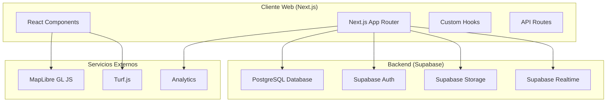
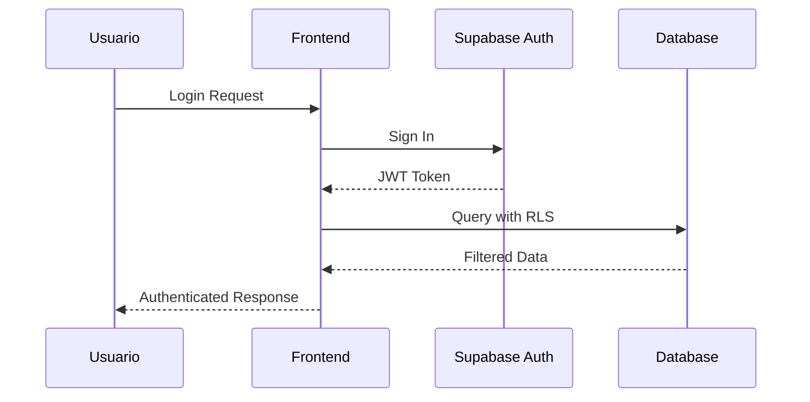
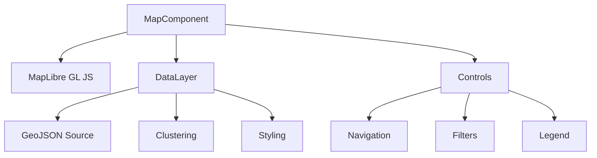
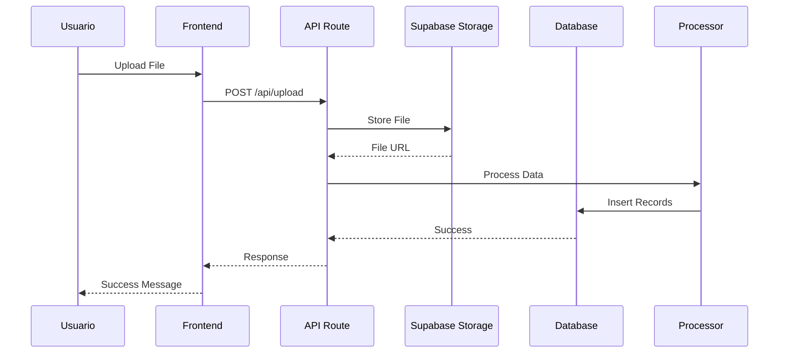
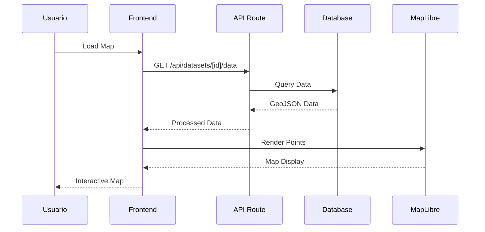
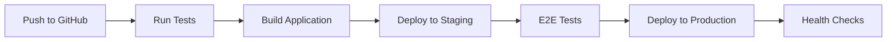

# 🏗️ Arquitectura del Sistema

## Visión General

Mapa Ambiental es una plataforma web moderna construida con arquitectura de microservicios frontend, utilizando Next.js 15 con App Router como framework principal y Supabase como backend-as-a-service. El sistema está diseñado para ser escalable, mantenible y fácil de extender.

## 🏛️ Arquitectura General

### Diagrama de Alto Nivel



### Principios Arquitectónicos

#### 1. **Separación de Responsabilidades**
- **Frontend**: Manejo de UI/UX y lógica de presentación
- **Backend**: Gestión de datos, autenticación y lógica de negocio
- **API**: Comunicación entre frontend y backend

#### 2. **Componentización**
- Componentes reutilizables y modulares
- Separación clara entre lógica de presentación y lógica de negocio
- Composición sobre herencia

#### 3. **Type Safety**
- TypeScript en todo el codebase
- Validación de datos con Zod
- Interfaces bien definidas

#### 4. **Performance First**
- Server-Side Rendering (SSR)
- Static Generation donde aplica
- Code Splitting automático
- Lazy Loading de componentes

## 📁 Estructura del Proyecto

```
src/
├── app/                          # Next.js App Router
│   ├── (auth)/                  # Rutas protegidas por auth
│   │   ├── layout.tsx          # Layout para rutas autenticadas
│   │   ├── mapa/               # Página principal del mapa
│   │   └── dashboard/          # Dashboard del usuario
│   ├── admin/                   # Panel administrativo
│   │   ├── datasets/           # Gestión de datasets
│   │   └── usuarios/           # Gestión de usuarios
│   ├── api/                     # API Routes
│   │   ├── auth/               # Endpoints de autenticación
│   │   ├── datasets/           # CRUD de datasets
│   │   └── upload/             # Upload de archivos
│   ├── guia/                    # Documentación integrada
│   ├── globals.css             # Estilos globales
│   ├── layout.tsx              # Layout raíz
│   └── page.tsx                # Página de inicio
├── components/                  # Componentes React
│   ├── ui/                     # Componentes base (shadcn/ui)
│   │   ├── button.tsx
│   │   ├── input.tsx
│   │   └── ...
│   ├── MapComponent.tsx        # Componente principal del mapa
│   ├── UploadWizard.tsx        # Wizard de carga
│   ├── DataFilters.tsx         # Filtros de datos
│   └── ...
├── hooks/                      # Custom Hooks
│   ├── useAuth.ts              # Hook de autenticación
│   ├── useDatasets.ts          # Hook de datasets
│   ├── useMap.ts               # Hook del mapa
│   └── ...
├── lib/                        # Utilidades y configuraciones
│   ├── supabase.ts             # Cliente Supabase
│   ├── utils.ts                # Funciones utilitarias
│   ├── constants.ts            # Constantes
│   └── ...
├── types/                      # Definiciones TypeScript
│   ├── database.ts             # Tipos de base de datos
│   ├── api.ts                  # Tipos de API
│   ├── components.ts           # Tipos de componentes
│   └── ...
└── utils/                      # Utilidades específicas
    ├── data-processing.ts      # Procesamiento de datos
    ├── map-utils.ts            # Utilidades del mapa
    └── ...
```

## 🗄️ Arquitectura de Base de Datos

### Esquema Principal

```sql
-- Tabla principal de datasets
CREATE TABLE datasets (
    id UUID PRIMARY KEY DEFAULT gen_random_uuid(),
    name VARCHAR(255) NOT NULL,
    description TEXT,
    owner_id UUID REFERENCES auth.users(id) ON DELETE CASCADE,
    is_public BOOLEAN DEFAULT false,
    created_at TIMESTAMP WITH TIME ZONE DEFAULT NOW(),
    updated_at TIMESTAMP WITH TIME ZONE DEFAULT NOW()
);

-- Archivos asociados a datasets
CREATE TABLE dataset_files (
    id UUID PRIMARY KEY DEFAULT gen_random_uuid(),
    dataset_id UUID REFERENCES datasets(id) ON DELETE CASCADE,
    file_name VARCHAR(255) NOT NULL,
    file_type VARCHAR(50) NOT NULL,
    file_size INTEGER,
    storage_path TEXT NOT NULL,
    uploaded_at TIMESTAMP WITH TIME ZONE DEFAULT NOW()
);

-- Datos ambientales procesados
CREATE TABLE environmental_data (
    id UUID PRIMARY KEY DEFAULT gen_random_uuid(),
    dataset_id UUID REFERENCES datasets(id) ON DELETE CASCADE,
    latitude DECIMAL(10, 8) NOT NULL,
    longitude DECIMAL(11, 8) NOT NULL,
    data_date DATE NOT NULL,
    parameters JSONB NOT NULL, -- Parámetros ambientales flexibles
    created_at TIMESTAMP WITH TIME ZONE DEFAULT NOW()
);

-- Perfiles de usuario extendidos
CREATE TABLE user_profiles (
    id UUID PRIMARY KEY REFERENCES auth.users(id) ON DELETE CASCADE,
    full_name VARCHAR(255),
    organization VARCHAR(255),
    role VARCHAR(50) DEFAULT 'user',
    preferences JSONB DEFAULT '{}',
    created_at TIMESTAMP WITH TIME ZONE DEFAULT NOW(),
    updated_at TIMESTAMP WITH TIME ZONE DEFAULT NOW()
);

-- Logs de auditoría
CREATE TABLE audit_logs (
    id UUID PRIMARY KEY DEFAULT gen_random_uuid(),
    user_id UUID REFERENCES auth.users(id) ON DELETE CASCADE,
    action VARCHAR(100) NOT NULL,
    resource VARCHAR(100) NOT NULL,
    resource_id UUID,
    details JSONB,
    ip_address INET,
    user_agent TEXT,
    created_at TIMESTAMP WITH TIME ZONE DEFAULT NOW()
);
```

### Políticas de Seguridad (RLS)

```sql
-- Datasets: Solo propietario puede modificar
ALTER TABLE datasets ENABLE ROW LEVEL SECURITY;
CREATE POLICY "Users can view public datasets and own datasets" ON datasets
    FOR SELECT USING (is_public = true OR owner_id = auth.uid());
CREATE POLICY "Users can insert their own datasets" ON datasets
    FOR INSERT WITH CHECK (owner_id = auth.uid());
CREATE POLICY "Users can update their own datasets" ON datasets
    FOR UPDATE USING (owner_id = auth.uid());

-- Datos ambientales: Acceso basado en dataset
ALTER TABLE environmental_data ENABLE ROW LEVEL SECURITY;
CREATE POLICY "Users can access data from accessible datasets" ON environmental_data
    FOR SELECT USING (
        EXISTS (
            SELECT 1 FROM datasets
            WHERE datasets.id = environmental_data.dataset_id
            AND (datasets.is_public = true OR datasets.owner_id = auth.uid())
        )
    );
```

## 🔐 Sistema de Autenticación

### Arquitectura de Auth



### Roles y Permisos

| Rol | Descripción | Permisos |
|-----|-------------|----------|
| `admin` | Administrador del sistema | CRUD completo, gestión de usuarios |
| `editor` | Editor de datos | CRUD datasets, gestión propia |
| `viewer` | Visualizador | Solo lectura de datasets públicos |
| `user` | Usuario estándar | CRUD datasets propios |

## 🗺️ Arquitectura del Mapa

### Componentes del Mapa



### Gestión de Datos Geoespaciales

#### Procesamiento de Datos

```typescript
interface EnvironmentalPoint {
    id: string;
    coordinates: [number, number]; // [lng, lat]
    properties: {
        date: string;
        parameters: Record<string, number>;
        dataset_id: string;
    };
}

interface ProcessedDataset {
    id: string;
    name: string;
    points: EnvironmentalPoint[];
    bounds: [[number, number], [number, number]]; // [sw, ne]
    statistics: DatasetStatistics;
}
```

#### Estrategias de Optimización

1. **Clustering**: Agrupación de puntos cercanos
2. **Virtualización**: Renderizado solo de puntos visibles
3. **Cache**: Almacenamiento local de datos procesados
4. **Lazy Loading**: Carga progresiva de datos

## 📡 API Architecture

### API Routes Structure

```
api/
├── auth/
│   ├── callback.ts          # OAuth callback
│   ├── login.ts            # Login endpoint
│   └── logout.ts           # Logout endpoint
├── datasets/
│   ├── [id].ts             # CRUD operations
│   ├── [id]/data.ts        # Dataset data
│   └── upload.ts           # File upload
├── admin/
│   ├── users.ts            # User management
│   ├── stats.ts            # System statistics
│   └── audit.ts            # Audit logs
└── health.ts               # Health check
```

### API Response Format

```typescript
interface ApiResponse<T = any> {
    success: boolean;
    data?: T;
    error?: {
        code: string;
        message: string;
        details?: any;
    };
    meta?: {
        pagination?: PaginationInfo;
        timestamp: string;
    };
}

interface PaginationInfo {
    page: number;
    limit: number;
    total: number;
    totalPages: number;
}
```

## 🔄 Data Flow Architecture

### Flujo de Carga de Datos



### Flujo de Visualización



## 📊 Monitoreo y Observabilidad

### Métricas Principales

- **Performance**: Core Web Vitals, Time to Interactive
- **Usage**: Page views, user sessions, feature usage
- **Errors**: JavaScript errors, API failures
- **Business**: Dataset uploads, map interactions

### Herramientas de Monitoreo

- **Sentry**: Error tracking y performance monitoring
- **Vercel Analytics**: Web vitals y user analytics
- **Supabase Dashboard**: Database performance y usage
- **Custom Metrics**: Business metrics via API

## 🚀 Estrategias de Despliegue

### CI/CD Pipeline



### Environment Strategy

- **Development**: Local development con hot reload
- **Staging**: Deploy automático desde main branch
- **Production**: Deploy manual desde releases

### Scaling Strategy

- **Horizontal Scaling**: Multiple instances en Vercel
- **Database Scaling**: Supabase managed PostgreSQL
- **CDN**: Vercel Edge Network para assets estáticos
- **Caching**: Redis para datos frecuentemente accedidos

## 🔧 Decisiones Arquitectónicas

### ADR (Architectural Decision Records)

#### ADR-001: Elección de Next.js App Router
**Contexto**: Necesidad de una arquitectura moderna y performante
**Decisión**: Usar Next.js 15 con App Router
**Consecuencias**:
- ✅ Mejor performance con SSR/SSG
- ✅ Routing más intuitivo
- ✅ Mejor SEO
- ❌ Curva de aprendizaje inicial

#### ADR-002: Supabase como Backend
**Contexto**: Necesidad de backend rápido de implementar
**Decisión**: Usar Supabase como BaaS
**Consecuencias**:
- ✅ Desarrollo más rápido
- ✅ Autenticación incluida
- ✅ Real-time capabilities
- ❌ Vendor lock-in

#### ADR-003: TypeScript Estricto
**Contexto**: Necesidad de type safety en aplicación compleja
**Decisión**: TypeScript con configuración estricta
**Consecuencias**:
- ✅ Menos bugs en runtime
- ✅ Mejor DX con autocompletado
- ✅ Refactoring más seguro
- ❌ Mayor tiempo de desarrollo inicial

## 📈 Plan de Evolución

### Fase 1 (Actual): MVP Completo
- ✅ Mapa interactivo básico
- ✅ Autenticación y autorización
- ✅ Carga y procesamiento de datos
- ✅ Dashboard administrativo

### Fase 2: Características Avanzadas
- 🔄 Análisis avanzado con IA/ML
- 🔄 API pública para integraciones
- 🔄 Mobile app companion
- 🔄 Real-time collaboration

### Fase 3: Escalabilidad Empresarial
- 🔄 Multi-tenancy
- 🔄 Advanced analytics
- 🔄 Custom branding
- 🔄 Enterprise integrations

---

Esta arquitectura proporciona una base sólida y escalable para el crecimiento futuro de la plataforma Mapa Ambiental.